# Replication Package: Indonesia’s pulp sector risks reversing progress towards zero deforestation

[](https://doi.org/10.5281/zenodo.21542417)
[](https://www.r-project.org/)
[](https://www.docker.com/)

This repository contains the complete code, targets pipeline, and replication materials for:

> **Heilmayr, R., Benedict, J. J., Orland, B., Afif, H., Barr, C., Descals, A., Husnayaen, H., Kridalaksana, A., Manurung, T., Nagara, G., & Gaveau, D. (2026).** *Indonesia’s pulp sector risks reversing progress towards zero deforestation.* Science. [Zenodo Archive](https://doi.org/10.5281/zenodo.21542417).

---

## Overview

This repository uses the [`targets`](https://docs.ropensci.org/targets/) workflow management package alongside [`renv`](https://rstudio.github.io/renv/) to build an automated, fully reproducible pipeline for creating the figures and statistics on deforestation, pulp expansion areas, concession land-use change, and supply chain dynamics in Indonesia's pulpwood sector.

The pipeline fetches raw spatial and tabular data from Zenodo, executes all spatial overlay and statistical transformations, and generates the relevant summary figures and SI tables reported in the paper.

---

## Repository Structure

```text
.
├── R/                         # Custom modularized R functions powering targets
├── _targets.R                 # Main targets pipeline workflow definition
├── renv.lock                  # Lockfile pinning exact R package versions
├── Dockerfile                 # Container image specification for isolated builds
├── .dockerignore              # Rules to exclude large data files from Docker context
├── README.md                  # Replication documentation
└── data/                      # Local storage for raw Zenodo replication data and outputs (figures, table, text statistics)
```

---

## Pipeline Architecture

The directed acyclic graph (DAG) below illustrates the dependency structure between input data, intermediate processing targets, and final outputs.

```mermaid
graph LR
  style Legend fill:#FFFFFF00,stroke:#000000;
  style Graph fill:#FFFFFF00,stroke:#000000;
  subgraph Legend
    xf1522833a4d242c5(["Up to date"]):::uptodate
    xd03d7c7dd2ddda2b(["Regular target"]):::none
  end
  subgraph Graph
    direction LR
    x2471038d81883667(["ann_pulp_tbl_file"]):::uptodate --> x1a2a82b7bfddc64e(["ann_pulp_tbl"]):::uptodate
    x394e1cb677a7c8a3(["zenodo_data_check"]):::uptodate --> x2471038d81883667(["ann_pulp_tbl_file"]):::uptodate
    x2aa59f862ab96975(["cap_df_file"]):::uptodate --> xaa98c412c998e02d(["cap_df"]):::uptodate
    x394e1cb677a7c8a3(["zenodo_data_check"]):::uptodate --> x2aa59f862ab96975(["cap_df_file"]):::uptodate
    x83c47a185f57a2fa(["hti_annual_lc"]):::uptodate --> x62c811e64bc6d129(["concession_plots_saved"]):::uptodate
    xb7175ee013d00ee3(["id_pulp_conv_nonfor"]):::uptodate --> xde4d5ea15bf2c9ab(["defor_price_comb"]):::uptodate
    x9e47d5573c14d7e0(["id_pulp_conv_for"]):::uptodate --> xde4d5ea15bf2c9ab(["defor_price_comb"]):::uptodate
    xd317e3b82cff2062(["pulp_prices_clean"]):::uptodate --> xde4d5ea15bf2c9ab(["defor_price_comb"]):::uptodate
    xfddb6bc04976f88d(["fig1_summary"]):::uptodate --> x32ae0dcd0e8e9bb7(["fig1_files"]):::uptodate
    xde4d5ea15bf2c9ab(["defor_price_comb"]):::uptodate --> x54d64fc7015ffa3f(["fig1_panel_a"]):::uptodate
    xaac394cbbabd063e(["pulp_prod_ratio_merged"]):::uptodate --> x136e83af9016132f(["fig1_panel_b"]):::uptodate
    x6cec0a01c0657698(["tl_df"]):::uptodate --> xf069c11ae04419a6(["fig1_panel_c"]):::uptodate
    x136e83af9016132f(["fig1_panel_b"]):::uptodate --> xfddb6bc04976f88d(["fig1_summary"]):::uptodate
    x54d64fc7015ffa3f(["fig1_panel_a"]):::uptodate --> xfddb6bc04976f88d(["fig1_summary"]):::uptodate
    xf069c11ae04419a6(["fig1_panel_c"]):::uptodate --> xfddb6bc04976f88d(["fig1_summary"]):::uptodate
    xe1235d4647535bdf(["freq_tab_fig2"]):::uptodate --> xdb9342fa417d0245(["fig2_png"]):::uptodate
    x6ddfa4441f9553cd(["hti_conv_timing"]):::uptodate --> xe1235d4647535bdf(["freq_tab_fig2"]):::uptodate
    x394e1cb677a7c8a3(["zenodo_data_check"]):::uptodate --> xe46a560838d0b607(["groups_reclass_file"]):::uptodate
    xe46a560838d0b607(["groups_reclass_file"]):::uptodate --> xfc1022d2c56ee39b(["groups_reclass_hti"]):::uptodate
    xb7fd4d9fb61478f2(["hti_file"]):::uptodate --> xd0bfab563cc678ca(["hti"]):::uptodate
    xbdbaa7885a3b02ed(["hti_annual_lc_file"]):::uptodate --> x83c47a185f57a2fa(["hti_annual_lc"]):::uptodate
    x394e1cb677a7c8a3(["zenodo_data_check"]):::uptodate --> xbdbaa7885a3b02ed(["hti_annual_lc_file"]):::uptodate
    xd0bfab563cc678ca(["hti"]):::uptodate --> x401673d7a56cd519(["hti_concession_names"]):::uptodate
    x04549c461ac7df82(["hti_conv_timing_file"]):::uptodate --> x6ddfa4441f9553cd(["hti_conv_timing"]):::uptodate
    x394e1cb677a7c8a3(["zenodo_data_check"]):::uptodate --> x04549c461ac7df82(["hti_conv_timing_file"]):::uptodate
    xf23b8d86dfa43e0c(["lic_dates_hti"]):::uptodate --> x61382212b9b830d0(["hti_dates_clean"]):::uptodate
    x394e1cb677a7c8a3(["zenodo_data_check"]):::uptodate --> xb7fd4d9fb61478f2(["hti_file"]):::uptodate
    x0132e990bf8e32d2(["hti_nonhti_conv_file"]):::uptodate --> xbc6bba213d90a426(["hti_nonhti_conv"]):::uptodate
    x394e1cb677a7c8a3(["zenodo_data_check"]):::uptodate --> x0132e990bf8e32d2(["hti_nonhti_conv_file"]):::uptodate
    x76ac0395b91b49ee(["samples_df"]):::uptodate --> x649d24bbb36428d7(["hti_pulp_conv"]):::uptodate
    x649d24bbb36428d7(["hti_pulp_conv"]):::uptodate --> xcae9407c4cdf1897(["hti_pulp_conv_all"]):::uptodate
    x649d24bbb36428d7(["hti_pulp_conv"]):::uptodate --> x535239f05f2088de(["hti_pulp_conv_license"]):::uptodate
    xbc6bba213d90a426(["hti_nonhti_conv"]):::uptodate --> x5f23692a28ac41ba(["hti_pulp_driven_defor"]):::uptodate
    x394e1cb677a7c8a3(["zenodo_data_check"]):::uptodate --> xf9a39a25fe073615(["id_annual_exp_file"]):::uptodate
    xf9a39a25fe073615(["id_annual_exp_file"]):::uptodate --> xca35ef5996543636(["id_annual_exp_stats"]):::uptodate
    xf9499025a85e85f8(["pulp_for_id"]):::uptodate --> x9e47d5573c14d7e0(["id_pulp_conv_for"]):::uptodate
    x2b80220c4d979272(["islands_df"]):::uptodate --> x9e47d5573c14d7e0(["id_pulp_conv_for"]):::uptodate
    x46af6ee958ab9311(["pulp_nonfor_id"]):::uptodate --> xb7175ee013d00ee3(["id_pulp_conv_nonfor"]):::uptodate
    x2b80220c4d979272(["islands_df"]):::uptodate --> xb7175ee013d00ee3(["id_pulp_conv_nonfor"]):::uptodate
    x9bcd88cfbe9533ed(["kab"]):::uptodate --> x2b80220c4d979272(["islands_df"]):::uptodate
    x15870fc39b2df4ef(["kab_file"]):::uptodate --> x9bcd88cfbe9533ed(["kab"]):::uptodate
    x394e1cb677a7c8a3(["zenodo_data_check"]):::uptodate --> x15870fc39b2df4ef(["kab_file"]):::uptodate
    x4c8f2599d1ab9272(["kali_exp_file"]):::uptodate --> xede280a4f3524810(["kali_annual_pulp_exp_stats"]):::uptodate
    x394e1cb677a7c8a3(["zenodo_data_check"]):::uptodate --> x4c8f2599d1ab9272(["kali_exp_file"]):::uptodate
    x9659d4068fe31ab4(["lic_dates_hti_file"]):::uptodate --> xf23b8d86dfa43e0c(["lic_dates_hti"]):::uptodate
    x394e1cb677a7c8a3(["zenodo_data_check"]):::uptodate --> x9659d4068fe31ab4(["lic_dates_hti_file"]):::uptodate
    x57bf94fcb78c0091(["mai_file"]):::uptodate --> xb59229ffa9202e24(["mai_df"]):::uptodate
    x394e1cb677a7c8a3(["zenodo_data_check"]):::uptodate --> x57bf94fcb78c0091(["mai_file"]):::uptodate
    xca35ef5996543636(["id_annual_exp_stats"]):::uptodate --> x9126dcb38292aaa4(["paper_stats"]):::uptodate
    xaa98c412c998e02d(["cap_df"]):::uptodate --> x9126dcb38292aaa4(["paper_stats"]):::uptodate
    xbc6bba213d90a426(["hti_nonhti_conv"]):::uptodate --> x9126dcb38292aaa4(["paper_stats"]):::uptodate
    x06ce4f09a2e710b4(["pulp_ttm_soil_type"]):::uptodate --> x9126dcb38292aaa4(["paper_stats"]):::uptodate
    x79851b2ebc1bfd0e(["ws_2015_2022"]):::uptodate --> x9126dcb38292aaa4(["paper_stats"]):::uptodate
    x4bb357ac7c3a3d24(["pw_annual_area_id"]):::uptodate --> x9126dcb38292aaa4(["paper_stats"]):::uptodate
    xfc1022d2c56ee39b(["groups_reclass_hti"]):::uptodate --> x9126dcb38292aaa4(["paper_stats"]):::uptodate
    x715ffc3e76546010(["scenario_stats"]):::uptodate --> x9126dcb38292aaa4(["paper_stats"]):::uptodate
    xede280a4f3524810(["kali_annual_pulp_exp_stats"]):::uptodate --> x9126dcb38292aaa4(["paper_stats"]):::uptodate
    xb59229ffa9202e24(["mai_df"]):::uptodate --> x9126dcb38292aaa4(["paper_stats"]):::uptodate
    x7bb0e61b42c0fea3(["rs_acc_df"]):::uptodate --> x9126dcb38292aaa4(["paper_stats"]):::uptodate
    x9126dcb38292aaa4(["paper_stats"]):::uptodate --> xf59c0e6855230823(["paper_stats_txt"]):::uptodate
    x44feebfcbf561273(["policy_tl_file"]):::uptodate --> x6617370f32aaabcc(["policy_tl"]):::uptodate
    x394e1cb677a7c8a3(["zenodo_data_check"]):::uptodate --> x44feebfcbf561273(["policy_tl_file"]):::uptodate
    x50f1bf0af752093c(["pulp_for_id_file"]):::uptodate --> xf9499025a85e85f8(["pulp_for_id"]):::uptodate
    x394e1cb677a7c8a3(["zenodo_data_check"]):::uptodate --> x50f1bf0af752093c(["pulp_for_id_file"]):::uptodate
    xd888f5c328d811f2(["pulp_nonfor_id_file"]):::uptodate --> x46af6ee958ab9311(["pulp_nonfor_id"]):::uptodate
    x394e1cb677a7c8a3(["zenodo_data_check"]):::uptodate --> xd888f5c328d811f2(["pulp_nonfor_id_file"]):::uptodate
    xcf2144f96514c9d4(["pulp_prices_file"]):::uptodate --> x47f9d3746bbdb4ec(["pulp_prices"]):::uptodate
    x47f9d3746bbdb4ec(["pulp_prices"]):::uptodate --> xd317e3b82cff2062(["pulp_prices_clean"]):::uptodate
    x394e1cb677a7c8a3(["zenodo_data_check"]):::uptodate --> xcf2144f96514c9d4(["pulp_prices_file"]):::uptodate
    x558a5385bd604098(["pulp_production"]):::uptodate --> xaac394cbbabd063e(["pulp_prod_ratio_merged"]):::uptodate
    x7a459c024c52f47c(["timber_for_pulp"]):::uptodate --> xaac394cbbabd063e(["pulp_prod_ratio_merged"]):::uptodate
    x728431cb956d1a12(["pulp_production_file"]):::uptodate --> x558a5385bd604098(["pulp_production"]):::uptodate
    x394e1cb677a7c8a3(["zenodo_data_check"]):::uptodate --> x728431cb956d1a12(["pulp_production_file"]):::uptodate
    x394e1cb677a7c8a3(["zenodo_data_check"]):::uptodate --> x5e4d873637b85888(["pulp_soil_file"]):::uptodate
    x5e4d873637b85888(["pulp_soil_file"]):::uptodate --> x06ce4f09a2e710b4(["pulp_ttm_soil_type"]):::uptodate
    x394e1cb677a7c8a3(["zenodo_data_check"]):::uptodate --> x50ac17dec937a212(["pw_annual_area_file"]):::uptodate
    x50ac17dec937a212(["pw_annual_area_file"]):::uptodate --> x4bb357ac7c3a3d24(["pw_annual_area_id"]):::uptodate
    xaffd19925a7d4ba6(["rs_acc_file"]):::uptodate --> x7bb0e61b42c0fea3(["rs_acc_df"]):::uptodate
    x394e1cb677a7c8a3(["zenodo_data_check"]):::uptodate --> xaffd19925a7d4ba6(["rs_acc_file"]):::uptodate
    x61382212b9b830d0(["hti_dates_clean"]):::uptodate --> x76ac0395b91b49ee(["samples_df"]):::uptodate
    x401673d7a56cd519(["hti_concession_names"]):::uptodate --> x76ac0395b91b49ee(["samples_df"]):::uptodate
    x49e51f4509706894(["samples_gfc_ttm"]):::uptodate --> x76ac0395b91b49ee(["samples_df"]):::uptodate
    x9ea4f47ffb723de7(["samples_hti"]):::uptodate --> x76ac0395b91b49ee(["samples_df"]):::uptodate
    x955c5685cb1eeee2(["samples_landuse_ttm"]):::uptodate --> x76ac0395b91b49ee(["samples_df"]):::uptodate
    xa5d679a8aba631e2(["samples_gfc_ttm_file"]):::uptodate --> x49e51f4509706894(["samples_gfc_ttm"]):::uptodate
    x394e1cb677a7c8a3(["zenodo_data_check"]):::uptodate --> xa5d679a8aba631e2(["samples_gfc_ttm_file"]):::uptodate
    x2b310680af5434b6(["samples_hti_file"]):::uptodate --> x9ea4f47ffb723de7(["samples_hti"]):::uptodate
    x394e1cb677a7c8a3(["zenodo_data_check"]):::uptodate --> x2b310680af5434b6(["samples_hti_file"]):::uptodate
    xfd7ac45a8e499f86(["samples_landuse_ttm_file"]):::uptodate --> x955c5685cb1eeee2(["samples_landuse_ttm"]):::uptodate
    x394e1cb677a7c8a3(["zenodo_data_check"]):::uptodate --> xfd7ac45a8e499f86(["samples_landuse_ttm_file"]):::uptodate
    x8ddc295b514d9fb1(["scenario_stats_file"]):::uptodate --> x715ffc3e76546010(["scenario_stats"]):::uptodate
    x394e1cb677a7c8a3(["zenodo_data_check"]):::uptodate --> x8ddc295b514d9fb1(["scenario_stats_file"]):::uptodate
    x2df81a88cbeddd76(["si_table_2_df"]):::uptodate --> x136760e62d80419e(["si_table_2_csv"]):::uptodate
    x1a2a82b7bfddc64e(["ann_pulp_tbl"]):::uptodate --> x2df81a88cbeddd76(["si_table_2_df"]):::uptodate
    x5f23692a28ac41ba(["hti_pulp_driven_defor"]):::uptodate --> x2df81a88cbeddd76(["si_table_2_df"]):::uptodate
    xcae9407c4cdf1897(["hti_pulp_conv_all"]):::uptodate --> x2df81a88cbeddd76(["si_table_2_df"]):::uptodate
    x535239f05f2088de(["hti_pulp_conv_license"]):::uptodate --> x2df81a88cbeddd76(["si_table_2_df"]):::uptodate
    xdd8a529ac96e7ef3(["timber_for_pulp_file"]):::uptodate --> x7a459c024c52f47c(["timber_for_pulp"]):::uptodate
    x394e1cb677a7c8a3(["zenodo_data_check"]):::uptodate --> xdd8a529ac96e7ef3(["timber_for_pulp_file"]):::uptodate
    x6617370f32aaabcc(["policy_tl"]):::uptodate --> x6cec0a01c0657698(["tl_df"]):::uptodate
    xc206cc5f8e70ef25(["ws_2015_2022_file"]):::uptodate --> x79851b2ebc1bfd0e(["ws_2015_2022"]):::uptodate
    x394e1cb677a7c8a3(["zenodo_data_check"]):::uptodate --> xc206cc5f8e70ef25(["ws_2015_2022_file"]):::uptodate
  end
  classDef uptodate stroke:#000000,color:#ffffff,fill:#354823;
  classDef none stroke:#000000,color:#000000,fill:#94a4ac;
```


---

## Data Availability & Automation

All required raw input files are archived on Zenodo ([DOI: 10.5281/zenodo.21542417](https://doi.org/10.5281/zenodo.21542417)).

You do not need to download raw datasets manually. The `zenodo_data_check` target in `_targets.R` automatically checks for local data and downloads `01_data_replication.zip` into `data/01_data_replication/` during the first pipeline execution if files are absent.

---

## System & Hardware Requirements

* **RAM**: Minimum 16 GB recommended due to memory-intensive spatial operations (`sf`, `terra`).
* **Disk Space**: ~10 GB free space for raw zip downloads and `targets` cache files.
* **Software**: R (≥ 4.4.2) or Docker Desktop.

---

## Platform-Specific Notes

### macOS (Apple Silicon M1/M2/M3/M4)
* **Docker Architecture**: Build using x86_64 emulation if targeting Intel-based servers:
  ```bash
  docker build --platform linux/amd64 -t test-indo-defor .
  ```
* **Memory Allocation**: Docker Desktop defaults to 2 GB RAM, which cause container crashes (`Killed`) during spatial overlays. Set **Settings > Resources > Memory** to at least **8 GB – 12 GB**.
* **Local R Execution**: Requires Homebrew installation of spatial libraries (`gdal`, `geos`, `proj`) prior to compiling `sf` or `terra` locally.

### Windows (10/11)
* **Long Paths**: Enable Long Paths in Git/Windows if encountering file path length issues during zip extraction:
  ```bash
  git config --global core.longpaths true
  ```
* **Line Endings**: Set Git to preserve LF line endings:
  ```bash
  git config --global core.autocrlf input
  ```

### Linux (Ubuntu / Debian)
* **System Libraries**: For local R execution outside Docker, ensure C++ spatial headers are installed:
  ```bash
  sudo apt-get install libgdal-dev libgeos-dev libproj-dev libudunits2-dev
  ```

---

## Replication Instructions

You can execute the replication workflow through an interactive R session or inside an isolated Docker container.

### Option A: Local R Session (Recommended for Interactive Development)

1. **Clone the repository:**
   ```bash
   git clone https://github.com/jasonjb82/heilmayr-indo-pulp-deforestation-2026.git
   cd heilmayr-indo-pulp-deforestation-2026
   ```

2. **Restore package dependencies:**
   In your R/Positron console, run:
   ```R
   renv::restore()
   ```

3. **Inspect the pipeline graph (Optional):**
   ```R
   targets::tar_visnetwork()
   ```

4. **Run the replication pipeline:**
   ```R
   targets::tar_make()
   ```

Outputs are automatically populated into the following locations:

* **Figures:** `data/01_data_replication/04_results/`
* **Text statistics and pulp expansion table:** `data/01_data_replication/02_tables/paper_text_snippets.txt` and `data/01_data_replication/02_tables/pulp_expansion_areas_all_2001_2022.csv`

---

### Option B: Docker Container (Isolated Build)

Docker standardizes execution across systems, but build flags and host folder mounting syntax vary slightly depending on your platform and terminal environment.

#### 1. Build the container image

* **Linux / Windows / Intel Mac:**
  ```bash
  docker build -t test-indo-defor
  ```

#### 2. **Run the container pipeline:**
   
To run the container and persist generated figures and tables directly back to your local disk, execute the command matching your operating system or shell:

* **Linux / Windows / Intel Mac:**
   ```bash
   docker run --rm -v "$(pwd)/data:/app/data" test-indo-defor
   ```

* **Windows PowerShell:**
   ```PowerShell
   docker run --rm -v "${PWD}/data:/app/data" test-indo-defor
   ```

* **Windows Command Prompt (CMD):**
   ```DOS
   docker run --rm -v "%cd%/data:/app/data" test-indo-defor
   ```
Memory Requirement: Ensure Docker Desktop has at least 8 GB–12 GB RAM assigned under Settings > Resources > Memory (macOS/Windows) to prevent out-of-memory crashes during spatial operations.

## Authors & Citation

**Authors:**
Robert Heilmayr, Jason Jon Benedict, Brian Orland, Hilman Afif, Christopher Barr, Adrià Descals, Husnayaen Husnayaen, Age Kridalaksana, Timer Manurung, Grahat Nagara, David Gaveau

**Suggested Citation:**
```bibtex
@article{heilmayr_2026_indonesia_pulp,
  title={Indonesia’s pulp sector risks reversing progress towards zero deforestation},
  author={Heilmayr, Robert and Benedict, Jason Jon and Orland, Brian and Afif, Hilman and Barr, Christopher and Descals, Adri{\a} and Husnayaen, Husnayaen and Kridalaksana, Age and Manurung, Timer and Nagara, Grahat and Gaveau, David},
  journal={Science},
  year={2026},
  doi={10.5281/zenodo.21542417}
}
```

## License

The code in this repository is open-source under the [MIT License](LICENSE). Input datasets are provided under creative commons licenses as specified on Zenodo.
