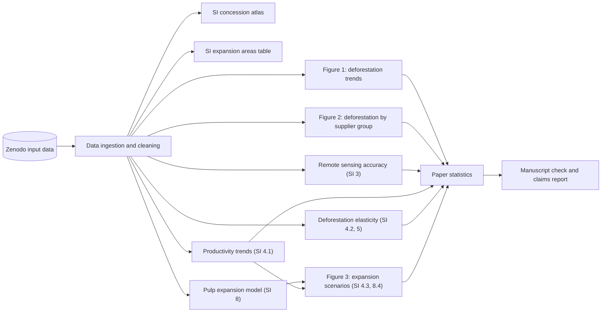

# Replication package: Rising risk of deforestation in Indonesia’s pulp sector

[](https://doi.org/10.5281/zenodo.20448606)
[](https://www.r-project.org/)
[](https://www.docker.com/)

This repository contains the code and `targets` pipeline that reproduce the
figures, tables and statistics in:

> **Heilmayr, R., Benedict, J. J., Orland, B., Afif, H., Barr, C., Descals, A., Husnayaen, H., Kridalaksana, A., Manurung, T., Nagara, G., & Gaveau, D. (2026).** *Rising risk of deforestation in Indonesia’s pulp sector.* Science.

The input data are archived on Zenodo:
[10.5281/zenodo.20448606](https://doi.org/10.5281/zenodo.20448606).

---

## Overview

The pipeline uses [`targets`](https://docs.ropensci.org/targets/) for workflow
management and [`renv`](https://rstudio.github.io/renv/) to pin package
versions. A single `tar_make()` downloads the input data from Zenodo and
produces:

- Figures 1–3 of the main text and the SI figures
- SI tables and the statements reported in the SI
- the remote sensing accuracy assessment, plantation productivity trends,
  deforestation price elasticities, the spatial model of pulpwood expansion
  and the expansion scenarios
- the SI concession atlas (one page per pulpwood concession)
- every number cited in the paper, checked against the published manuscript

The input data on Zenodo were prepared outside this pipeline (sample
extraction in Google Earth Engine and data preparation in R and Python). The
pipeline starts from those prepared inputs.

---

## Repository structure

```text
.
├── _targets.R           # Pipeline definition (all targets)
├── R/                   # Functions for the figures, tables and paper statistics
│   └── analysis/        # Analyses: accuracy, productivity, elasticity, expansion model, scenarios
├── manuscript/          # manuscript_values.csv: numbers as printed in the paper, for checking
├── typst/               # Template for the SI concession atlas
├── _dependencies.R      # Packages renv cannot detect from the code
├── renv.lock            # Pinned R package versions
├── Dockerfile           # Reference container (rocker/geospatial 4.5.2)
├── data/                # Created on first run: input data downloaded from Zenodo
└── outputs/             # Created on first run: all results
```

---

## Pipeline architecture

The pipeline has 127 targets. The diagram below summarises how its sections
connect; run `targets::tar_visnetwork()` for the full graph.


```mermaid
%%{init: {"flowchart": {"htmlLabels": false}} }%%
graph LR
  Z[("Zenodo input data")] --> B["Data ingestion and cleaning"]
  B --> F1["Figure 1: deforestation trends"]
  B --> F2["Figure 2: deforestation by supplier group"]
  B --> AT["SI concession atlas"]
  B --> T2["SI expansion areas table"]
  B --> RS["Remote sensing accuracy (SI 3)"]
  B --> MAI["Productivity trends (SI 4.1)"]
  B --> EL["Deforestation elasticity (SI 4.2, 5)"]
  B --> RF["Pulp expansion model (SI 8)"]
  RF --> SC["Figure 3: expansion scenarios (SI 4.3, 8.4)"]
  MAI --> SC
  F1 --> PS["Paper statistics"]
  F2 --> PS
  RS --> PS
  MAI --> PS
  EL --> PS
  SC --> PS
  PS --> MC["Manuscript check and claims report"]
```

---

## Data availability

All input data are archived on Zenodo
([concept DOI 10.5281/zenodo.20448606](https://doi.org/10.5281/zenodo.20448606),
which always resolves to the latest version). The record contains input data
only; all outputs are regenerated by the pipeline.

You do not need to download the data manually. On the first run, the
`zenodo_marker` target downloads `01_data_replication.zip` (481 MB; 4.1 GB
unzipped) into `data/01_data_replication/`. The download resumes if the
connection drops and is checked against the checksum Zenodo publishes. The
record ID used is set by `zenodo_record_id` in `_targets.R`.

Proprietary pulp and pulpwood price data (Fastmarkets, WRQ) cannot be
redistributed. The pipeline uses the derived annual price series
`pulp_prices_annual_2001_2024.csv` included in the Zenodo record.

---

## System requirements

- **R 4.5.2** (local runs) or **Docker** (reference platform)
- **RAM:** 16 GB recommended
- **Disk:** about 10 GB free (4.1 GB of input data, about 3 GB for the
  `targets` store, plus outputs)
- **Network:** needed to download the Zenodo data and to load the DM Sans font
  from Google Fonts when the figures are drawn
- **pandoc:** needed for the `.docx` SI tables (included in the Docker image)
- **Typst:** needed for the SI concession atlas (installed in the Docker image)
- **Run time:** about 50 minutes for a full run, of which about 30 minutes
  estimate the pulp expansion model. Later runs rebuild only what changed.

---

## Platform notes

Results reproduce exactly in the Docker image and on Windows. Native macOS
runs can differ slightly in the random forest model of pulpwood expansion (and
the scenario estimates based on it), because random number generation in the
`ranger` package depends on the compiler. **Use the Docker image as the
reference.**

### macOS (Apple Silicon)
- The Dockerfile builds a `linux/amd64` image, which runs under emulation.
- Docker Desktop's default memory can be too low for the spatial steps. Set
  **Settings > Resources > Memory** to at least 12 GB.
- Local runs need the spatial libraries (`gdal`, `geos`, `proj`), e.g. via
  Homebrew, before installing `sf` and `terra`.

### Windows (10/11)
- Enable long paths if file extraction fails:
  ```bash
  git config --global core.longpaths true
  ```
- Install [pandoc](https://pandoc.org/installing.html) and
  [Typst](https://github.com/typst/typst) for the `.docx` tables and the atlas.

### Linux (Ubuntu / Debian)
- For local runs outside Docker, install the spatial libraries first:
  ```bash
  sudo apt-get install libgdal-dev libgeos-dev libproj-dev libudunits2-dev
  ```

---

## Replication instructions

### Option A: Docker (reference)

1. **Clone the repository:**
   ```bash
   git clone https://github.com/jasonjb82/heilmayr-indo-pulp-deforestation-2026.git
   cd heilmayr-indo-pulp-deforestation-2026
   ```

2. **Build the image** (restores all R packages, so the first build takes a while):
   ```bash
   docker build -t indo-pulp-defor .
   ```

3. **Run the pipeline,** keeping the downloaded data and the results on your
   computer:

   - **Linux / macOS:**
     ```bash
     docker run --rm \
       -v "$(pwd)/data:/home/rstudio/indo_pulp_defor/data" \
       -v "$(pwd)/outputs:/home/rstudio/indo_pulp_defor/outputs" \
       indo-pulp-defor
     ```
   - **Windows PowerShell:**
     ```powershell
     docker run --rm `
       -v "${PWD}/data:/home/rstudio/indo_pulp_defor/data" `
       -v "${PWD}/outputs:/home/rstudio/indo_pulp_defor/outputs" `
       indo-pulp-defor
     ```

### Option B: Local R session

1. **Clone the repository** (as above) and open it in R, RStudio or Positron.

2. **Restore the package versions:**
   ```r
   renv::restore()
   ```

3. **Inspect the pipeline (optional):**
   ```r
   targets::tar_visnetwork()
   ```

4. **Run the pipeline:**
   ```r
   targets::tar_make()
   ```

---

## Outputs

All results are written to `outputs/`:

| Folder | Contents |
|---|---|
| `outputs/figures/` | Figures 1–3 and the SI figures (PNG and SVG); per-concession land cover figures in `concessions/` and `concession_tiles/` |
| `outputs/figure_data/` | Data behind Figures 1–3 (CSV) |
| `outputs/tables/` | SI tables (CSV and `.docx`), pulp expansion predictions and scenario results |
| `outputs/text/` | Statements reported in the paper and SI, model diagnostics, and the manuscript check |
| `outputs/atlas/` | SI concession atlas (PDF) |

`outputs/text/manuscript_check.csv` compares every number reported in the
paper (`manuscript/manuscript_values.csv`) with the value the pipeline
computes. `outputs/text/claims_report.md` lists each claim with the targets
and input files it comes from.

---

## Authors and citation

**Authors:**
Robert Heilmayr, Jason Jon Benedict, Brian Orland, Hilman Afif, Christopher
Barr, Adrià Descals, Husnayaen Husnayaen, Age Kridalaksana, Timer Manurung,
Grahat Nagara, David Gaveau

**Suggested citation:**
```bibtex
@article{heilmayr_2026_indonesia_pulp,
  title={Rising risk of deforestation in Indonesia’s pulp sector},
  author={Heilmayr, Robert and Benedict, Jason Jon and Orland, Brian and Afif, Hilman and Barr, Christopher and Descals, Adri{\`a} and Husnayaen, Husnayaen and Kridalaksana, Age and Manurung, Timer and Nagara, Grahat and Gaveau, David},
  journal={Science},
  year={2026}
}
```

**Data:**
```bibtex
@dataset{heilmayr_2026_indonesia_pulp_data,
  title={Replication package for "Rising risk of deforestation in Indonesia’s pulp sector"},
  author={Heilmayr, Robert and Benedict, Jason},
  publisher={Zenodo},
  year={2026},
  doi={10.5281/zenodo.20448606}
}
```

---

## License

The code in this repository is released under the MIT License. The input data
on Zenodo are released under the Creative Commons Attribution 4.0
International (CC-BY-4.0) license.
